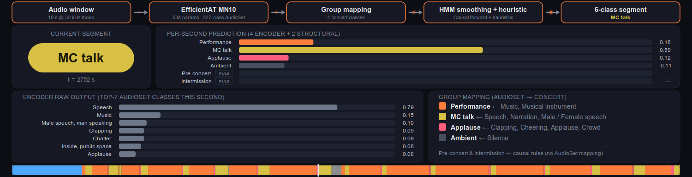

<div align="center">


# CueSheet

### Live Demo of Multi-Genre Concert Segment Detection

[Yonghyun Kim](https://yonghyunk1m.notion.site)<sup>♯</sup> ·
[Takuya Yamamoto](https://www.linkedin.com/in/takuya-yamamoto-058356196/)<sup>♭</sup> ·
Ryuto Kikuchi<sup>♭</sup> ·
[Alexander Lerch](https://www.alexanderlerch.com)<sup>♯</sup> ·
[Kazunobu Kondo](https://www.linkedin.com/in/kazunobu-kondo-4a72964b/)<sup>♭</sup>

<sup>♭</sup>Yamaha Corporation · <sup>♯</sup>Georgia Tech


[](https://yonghyunk1m-cue-sheet.hf.space)
[](https://yonghyunk1m-cue-sheet.hf.space/about)
[](data/CONCERT-10.tsv)
[](LICENSE)
[](#license)
[](pyproject.toml)

</div>

---

<p align="center">
  
</p>

> **TL;DR.** **Concert Segment Detection** is the task of labeling every second of a live concert with its structural segment, one of **Pre-concert, Performance, MC talk, Applause, Intermission, Ambient**. **CueSheet** is a **browser-based, causal, single-CPU** live demo of this task. The pipeline uses **no trained parameters of its own**: an AudioSet-pretrained encoder (EfficientAT MN10, HTS-AT, PANN CNN14, or AST) feeds a fixed group mapping, an online HMM smoother, and two short structural rules. We also release **CONCERT-10 v1.0**, a ten-genre URL manifest covering 26 concerts (22 h) with per-second CueSheet-generated labels.

## Highlights

- **One CPU, no per-show training.** Frozen AudioSet encoder + hand-crafted group mapping + HMM (stay = 0.95) + two causal rules. Labels arrive at the 1 s hop with a 10 s cold-start.
- **Live in the browser.** [`yonghyunk1m-cue-sheet.hf.space`](https://yonghyunk1m-cue-sheet.hf.space). Drop-in audio upload, gallery playback, encoder swap. Each encoder's pooled weighted-F1 (across the four hand-labeled gallery shows) is displayed inline; per-show wF1 updates with the current selection.
- **Four interchangeable encoders.** EfficientAT MN10 (5 M), HTS-AT (31 M), PANN CNN14 (81 M), AST (87 M). Click the encoder stage to swap; precomputed posteriors swap the ribbon immediately, live inference re-runs from the playhead.
- **CONCERT-10 v1.0.** 26 concerts (22 h) across ten genres, released as a URL manifest ([`data/CONCERT-10.tsv`](data/CONCERT-10.tsv)) plus per-second labels ([`data/labels/`](data/labels/)). We distribute links and annotations, not the source media. Both under CC BY 4.0.
- **Reproducible.** `scripts/full_pipeline_6class_4shows.py` reproduces the §4 ablation. `scripts/multi_encoder_precompute.py` rebuilds the per-encoder gallery posteriors. `scripts/compute_encoder_scores.py` recomputes the inline wF1 numbers.

**Labels.** Per-second labels live in [`data/labels/`](data/labels/). Machine pseudo-labels (`bootstrap/`, all 26 concerts, with a `-1` low-confidence marker) and human-verified labels (`human/`, four concerts so far). The `.npz` schema, the `-1` convention, and how the bootstrap labels are generated are documented in [`data/README.md`](data/README.md).

## Scope

CueSheet is layered. This repository's **core is audio-only**. That is what
CONCERT-10 and the default browser demo cover. Song-structure is a separate
extension on top.

| Layer | What it adds |
| --- | --- |
| **Audio segment detection** (core) | per-second six-segment labels from audio alone |
| **Song structure** | section-level structure within Performance |

The per-second audio backbone is built so the layers compose rather than fork.
Adding song-structure later does not disturb the audio core.

## Repository

```
data/                            # CONCERT-10 v1.0 (manifest + per-second labels)
live/                            # streaming pipeline (encoder + HMM + rules)
demo/                            # FastAPI backend + browser UI (HF Space build)
cuesheet/                        # core package (encoders, group-map, HMM, eval)
scripts/                         # precompute, baselines, score computation
docs/                            # method summary, ablation results
LICENSE                          # Apache-2.0
pyproject.toml                   # project metadata and dependencies
uv.lock                          # pinned dependency lockfile
```

## Quick start

```bash
# 1. Install (uv resolves the lockfile)
uv sync

# 2. Fetch the gallery audio from the CONCERT-10 URLs (yt-dlp; ~230 min of audio)
bash scripts/download_data.sh

# 3. Reproduce the component ablation reported in §4 of the paper
uv run python scripts/full_pipeline_6class_4shows.py

# 4. Reproduce the per-encoder gallery posteriors (PANN / AST / HTS-AT)
uv run python scripts/multi_encoder_precompute.py

# 5. Recompute the per-encoder pooled wF1 numbers shown in the demo dropdown
uv run python scripts/compute_encoder_scores.py
```

The per-second human ground truth for the four evaluation shows is in
[`demo/data/`](demo/data/) (the `gt_labels` field of each show JSON), so steps
3–5 need only the audio from step 2. To run the browser demo locally:
`bash demo/run.sh`, then open <http://localhost:8001/cuesheet>.

Numbers and figures: [`docs/ABLATION_RESULTS.md`](docs/ABLATION_RESULTS.md), [`docs/METHOD_SUMMARY.md`](docs/METHOD_SUMMARY.md).

## Roadmap

- **Human-verified labels.** Four gallery shows ship human-checked per-second labels (`data/labels/human/`); the remaining concerts are being hand-labeled and will be added in future v1.x releases.
- **Song-level structure.** Extending the per-second segment track to song sections (intro, verse, chorus) within Performance.

## Citation

An arXiv preprint is in preparation. The BibTeX below will be finalized with the
arXiv identifier upon release.

```bibtex
@misc{cuesheet2026,
  title         = {CueSheet: Live Demo of Multi-Genre Concert Segment Detection},
  author        = {Kim, Yonghyun and Yamamoto, Takuya and Kikuchi, Ryuto and
                   Lerch, Alexander and Kondo, Kazunobu},
  year          = {2026},
  eprint        = {2606.xxxxx},
  archivePrefix = {arXiv},
  primaryClass  = {cs.SD},
  url           = {https://arxiv.org/abs/2606.xxxxx},
}
```

## License

| Component | License |
| --- | --- |
| Code | Apache-2.0 |
| Per-second labels + CONCERT-10 v1.0 manifest | CC BY 4.0 |
| 30 s audio excerpts on the HF Space | Fair-use academic demonstration |
| Source media at each manifest URL | Per each uploader's YouTube license, as of 2026-06-30 |

**Source-media compliance.** The CONCERT-10 manifest distributes URLs only. All entries are YouTube content under YouTube's default standard license; the uploader retains all rights unless the individual video is tagged Creative Commons. Anyone who fetches the source media for analysis, ourselves included, takes on source-side compliance for their own use, the same posture under which Google fetched the AudioSet YouTube corpus, distributed pre-extracted audio embeddings under CC BY 4.0, and published YAMNet as an Apache-2.0 model. The v1.0 released annotation is the per-second bootstrap labels (`data/labels/bootstrap/`), CC BY 4.0, independent timing annotations rather than redistributions of source audio. Cached encoder embeddings are deferred to v1.1 pending a source-license review.
